# Data Portal — Flowcharts & Architecture Diagrams

All diagrams use [Mermaid](https://mermaid.js.org/) syntax. Render in GitHub, VS Code (Mermaid extension), or [mermaid.live](https://mermaid.live).

---

## 1. Full System Architecture

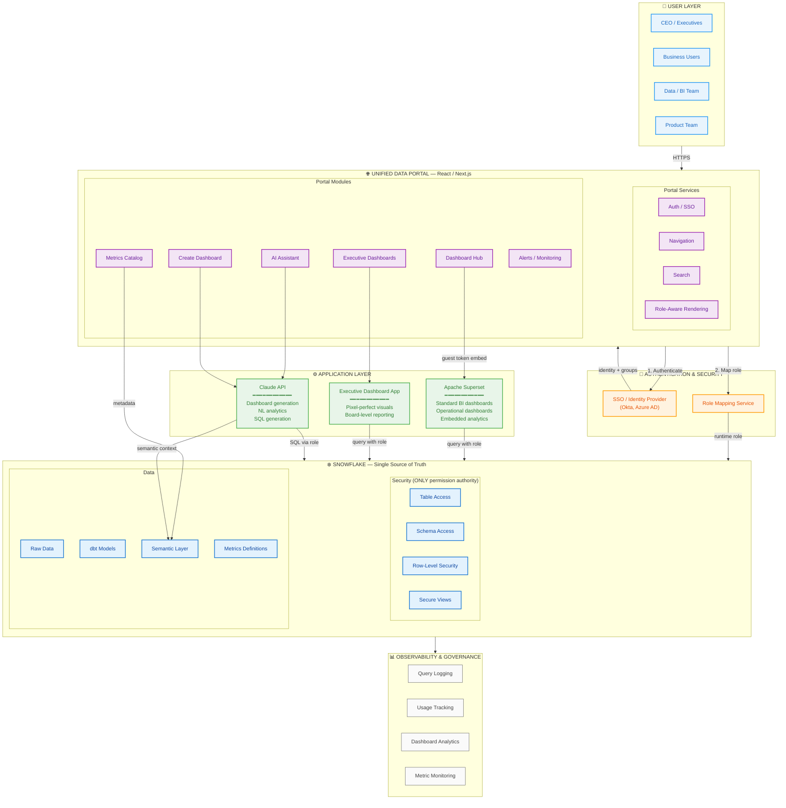

---

## 2. Authentication & Permission Flow

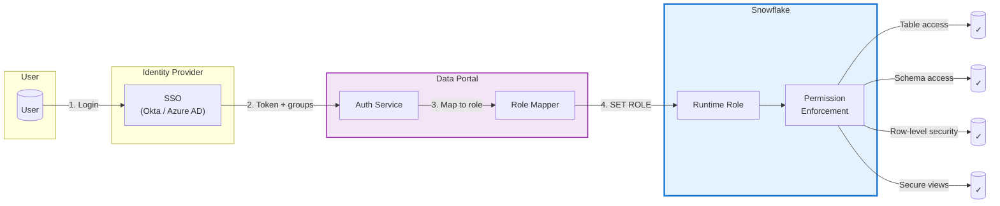

### Key Principle: No Permission Duplication

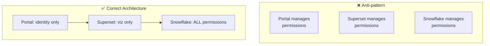

---

## 3. Superset Embedding Flow

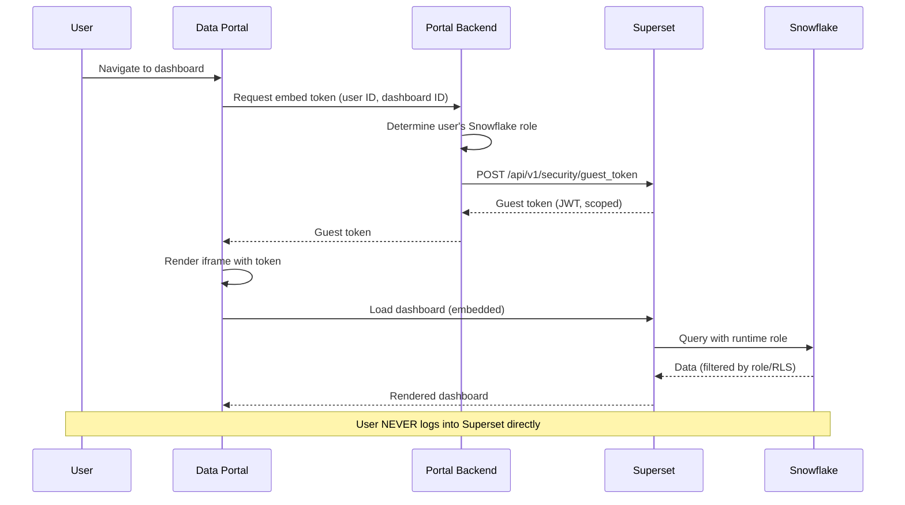

---

## 4. Top-Level Navigation Flow

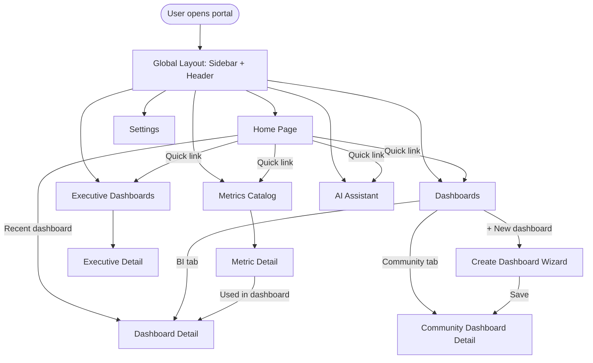

---

## 5. Dashboard Creation Flow (Spreadsheet Upload)

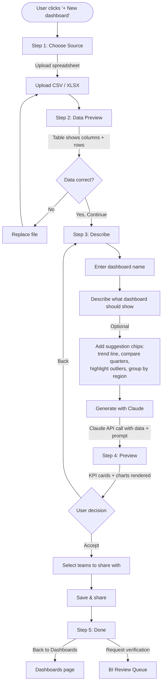

---

## 6. Dashboard Creation Flow (AI Assistant Path)

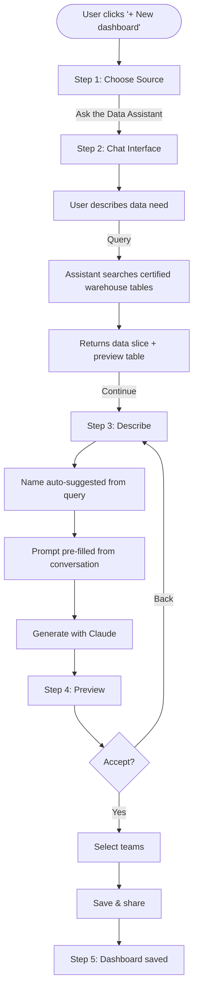

---

## 7. Dashboard Lifecycle & BI Verification

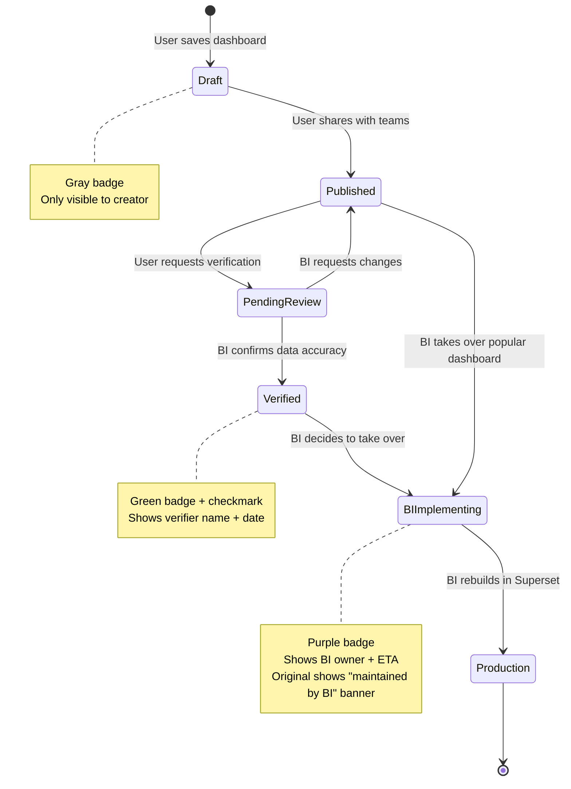

---

## 8. BI Review Queue Flow

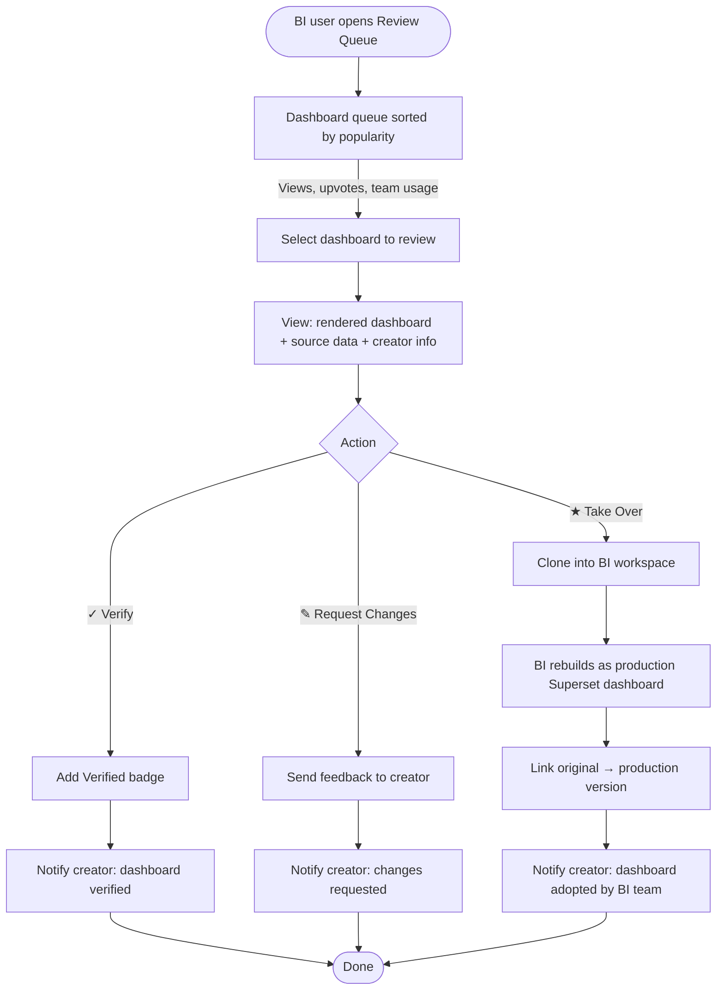

---

## 9. Metrics Catalog Flow

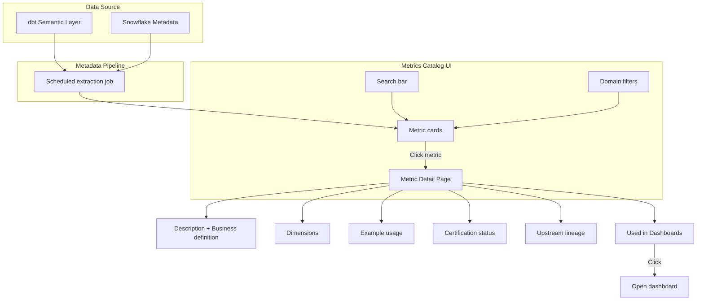

---

## 10. AI Assistant Flow

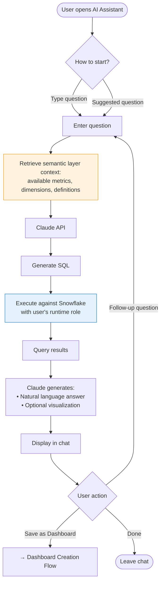

---

## 11. Runtime Role Propagation (Concurrent Users)

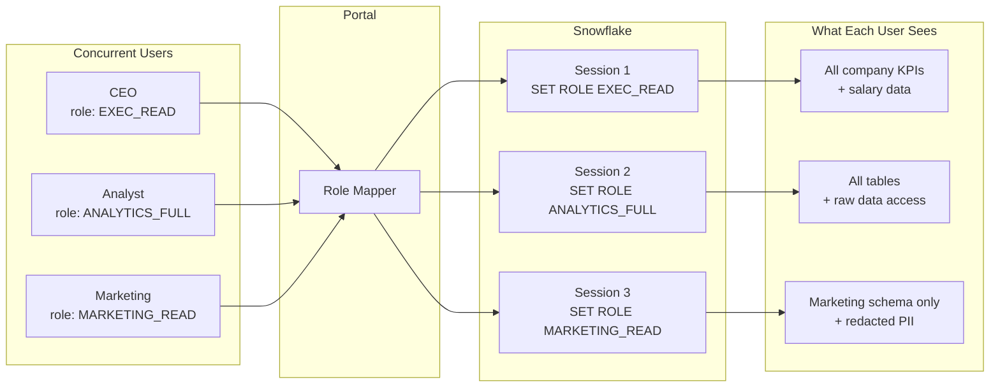

---

## 12. Complete Site Map

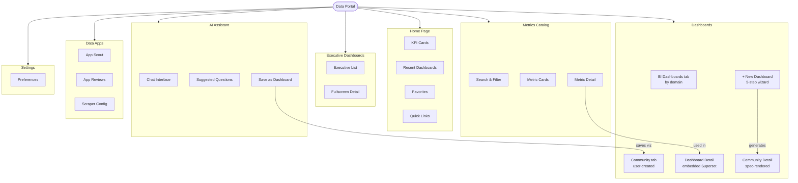
